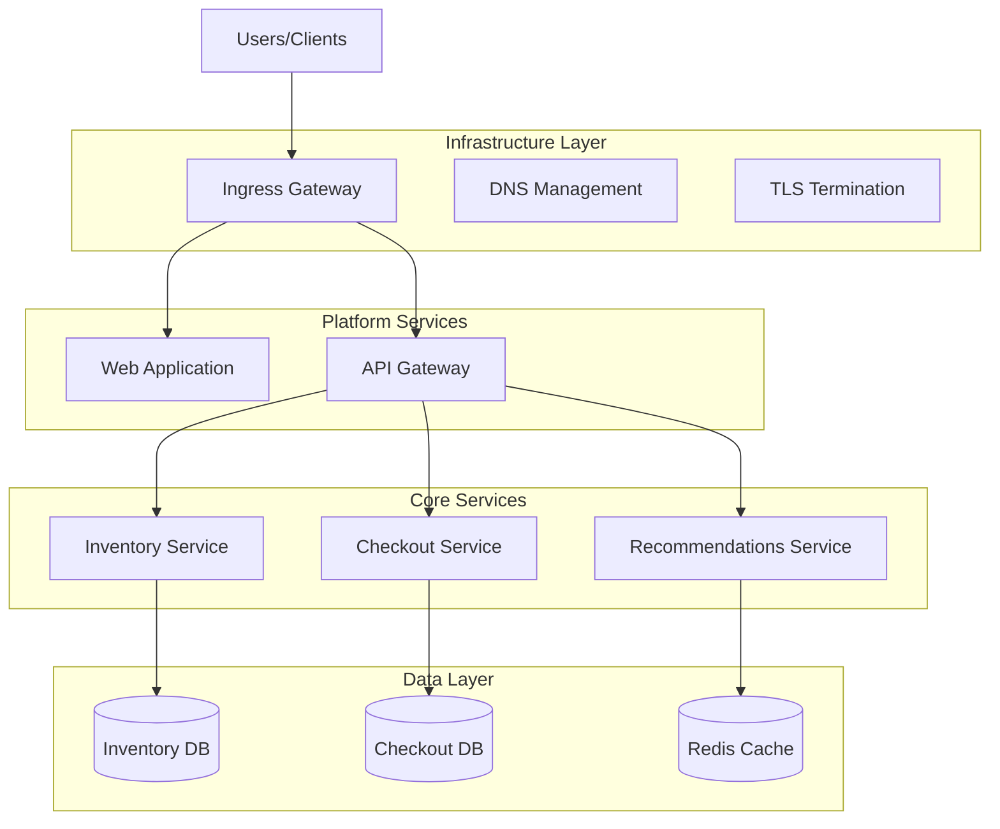
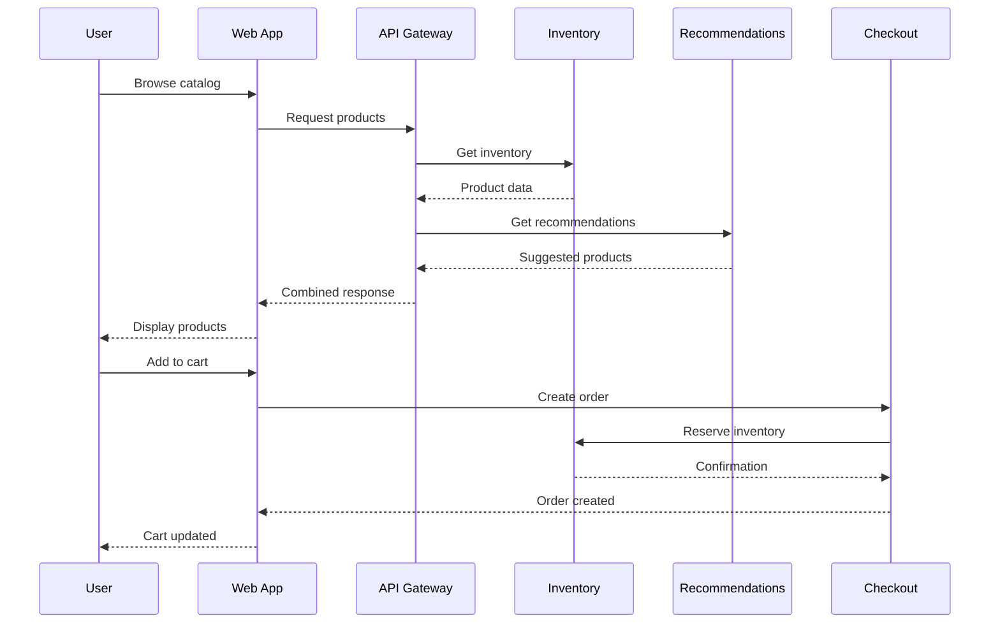
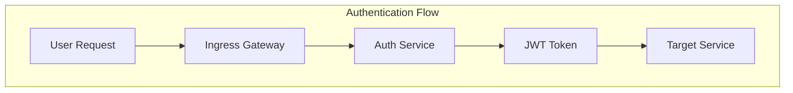

BookVerse Example Application Architecture
==========================================

DESCRIPTION

Application Component Services:

* [Checkout Service](https://github.com/bookverse-example/bookverse-checkout) —
  The Checkout Service handles the complete order lifecycle from cart management through payment processing and
  fulfillment.  Built with FastAPI and backed by PostgreSQL, it demonstrates the Multi-Container Application Pattern
  with separate containers for the API service, a background worker, and a payment mock — all promoted together as a
  single application version through the AppTrust pipeline.

* [Demo Assets](https://github.com/bookverse-example/bookverse-demo-assets) —
  The Demo Assets repository is the shared assets hub used by all BookVerse microservices during demonstrations.  It
  contains sample datasets and fixtures, example SBOMs and signed attestations, reusable GitHub Action composites and
  workflow snippets, and the presenter runbook for the demo flow.  It also provides ArgoCD bootstrap configuration for
  Helm repository credentials and Docker registry pull secrets.

* [Helm Charts](https://github.com/bookverse-example/bookverse-helm) —
  The Helm Charts repository provides production-ready Kubernetes deployment charts for the entire BookVerse platform.
  It demonstrates the Infrastructure-as-Code Application Pattern, packaging platform Helm charts, environment-specific
  values files, and Kubernetes manifests as versioned artifacts that are promoted together through the AppTrust pipeline
  to ensure deployment consistency across DEV, QA, STAGING, and PROD clusters.

* [Infrastructure Libraries](https://github.com/bookverse-example/bookverse-infra) —
  The Infrastructure Libraries repository houses shared components consumed by all BookVerse services: the
  `bookverse-core` Python library providing common authentication, utilities, and business logic, and the
  `bookverse-devops` package with automation scripts and DevOps tooling.  It demonstrates the Enterprise Library &
  DevOps Tooling Pattern, publishing multiple artifacts — Python packages, templates, and evidence configurations — that
  are promoted as a unit to guarantee consistent tooling across all environments.

* [Inventory Service](https://github.com/bookverse-example/bookverse-inventory) —
  The Inventory Service manages the BookVerse product catalog and real-time stock levels.  Built with FastAPI and SQLite,
  it exposes a RESTful API for catalog browsing, search, and availability queries.  As the simplest backend service, it
  demonstrates the Single Docker Image Application Pattern — a single container image accompanied by Python packages,
  SBOMs, and test reports, all moving together through the AppTrust promotion stages.

* [Platform Service](https://github.com/bookverse-example/bookverse-platform) —
  The Platform Service acts as the aggregation and coordination layer for the BookVerse ecosystem.  It manages
  cross-service version compatibility, orchestrates platform-wide releases, and runs integration tests that validate all
  services working together.  It demonstrates the Shared Library & Aggregator Pattern, bundling shared libraries,
  configuration templates, and platform utility containers into a single promotable application version.

* [Recommendations Service](https://github.com/bookverse-example/bookverse-recommendations) —
  The Recommendations Service delivers personalized book suggestions using configurable machine-learning algorithms with
  sub-200ms response times.  It employs a dual-architecture design with a FastAPI API server for real-time
  recommendations and a background worker process for content indexing and model updates, backed by Redis for
  high-performance caching.  It demonstrates the Multi-Container Orchestration Pattern with multiple Docker images and
  supporting artifacts.

* [Web Application](https://github.com/bookverse-example/bookverse-web) —
  The Web Application is the customer-facing frontend for the BookVerse bookstore, providing a responsive single-page
  application with client-side routing, product browsing, personalized recommendations, and a shopping cart and checkout
  flow.  Served via an Nginx container, it demonstrates the Static Asset Application Pattern — built JavaScript, CSS,
  and HTML assets packaged alongside their container image and promoted together through the AppTrust pipeline.

OTHER STUFFS
-------------

### 🔄 **Microservices Design**
- **Service Independence**: Each service owns its data and business logic
- **API-First**: All communication through well-defined REST APIs
- **Database per Service**: Dedicated data stores for service autonomy
- **Failure Isolation**: Retry mechanisms with exponential backoff and graceful degradation

### 🔐 **Security by Design**
- ****Authentication Framework**: JWT-based authentication with demo mode support
- **Secure Communication**: HTTP-based service communication with authentication headers
- **Least Privilege**: Minimal permissions and role-based access control
- **Evidence-Based Compliance**: Cryptographic audit trails

## 🗄️ Data Architecture

### 📊 **Data Store Strategy**

| Service | Database | Purpose | Justification |
|---------|----------|---------|---------------|
| **Inventory** | SQLite | Product catalog & stock | Lightweight, embedded, ACID |
| **Checkout** | PostgreSQL | Orders & transactions | ACID, complex queries, JSON |
| **Recommendations** | Redis | Cache & session data | High-performance caching, TTL |
| **Platform** | Config files | Service settings | Git-versioned, env-specific |

### 🔄 **Data Flow Patterns**

### 💾 **Data Consistency**

- **Eventual Consistency**: Non-critical data (recommendations, analytics)
- **Strong Consistency**: Critical data (orders, payments, inventory)
- **Optimistic Locking**: Conflict resolution for concurrent updates
- **Event Sourcing**: Audit trails for compliance and debugging

## 🔐 Security Architecture

### 🔑 **Authentication & Authorization**

**Security Layers:**
- **JWT Tokens**: Stateless authentication with configurable expiration
- **Role-Based Access**: Granular permissions per service and environment
- **API Gateway**: Centralized authentication and rate limiting

### 🛡️ **Security Controls**

| Control | Implementation | Purpose |
|---------|----------------|---------|
| **Network Security** | TLS 1.3, Private networks | Encrypted communication |
| **Access Control** | RBAC, Least privilege | Limited service access |
| **Secrets Management** | External secrets, Rotation | Secure credentials |
| **Vulnerability Scanning** | Automated scanning, SBOM | Supply chain security |
| **Evidence Collection** | Cryptographic signing | Compliance and audit |

