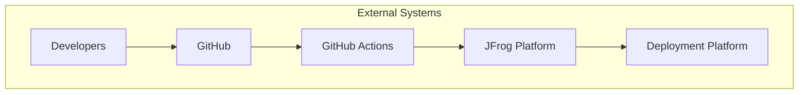
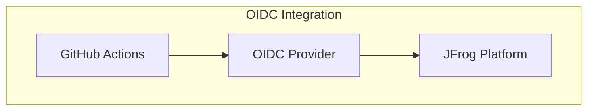
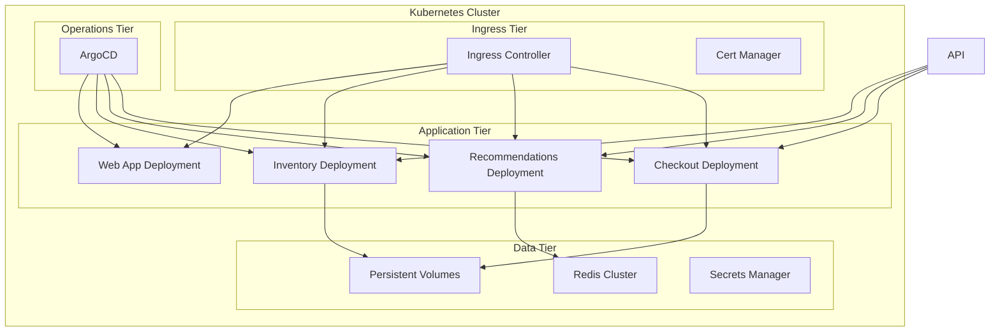
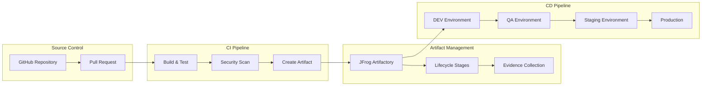

BookVerse Example Delivery Architecture
=======================================

The BookVerse Example follows common patterns used to deliver software securely.

Delivery Architecture Diagram
-----------------------------

[//]: <> (FIXME: Should this diagram show more directly the steps?  e.g. GHA pushes to JF, then GHA pulls from JF and pushes to DP, then DP pulls from JF)

Delivery Components
-------------------

* Developers

* Source Code (GitHub)

* Build System (GitHub Actions)

* JFrog Platform
  * Artifactory
  * AppTrust
  * Evidence
  * Projects
  * Stages
  * Xray

* Deployment Platform
  * Kubernetes
  * ArgoCD

[//]: <> (FIXME: Should there be a section going into more details about the JFrog Features used?  Or should that be its own page or pages?)

OTHER STUFFS
------------

### 🛡️ **Governance & Policy Framework**

BookVerse implements comprehensive governance through **JFrog Unified Policies** that enforce quality gates, security requirements, and compliance controls across the entire software development lifecycle.

#### **Policy Architecture Overview**

The BookVerse platform uses a multi-stage governance model with policy enforcement at each lifecycle gate:

```mermaid
graph LR
    A[Code Commit] --> B[DEV Entry Gates]
    B --> C[DEV Stage]
    C --> D[DEV Exit Gates]
    D --> E[QA Entry]
    E --> F[QA Stage]
    F --> G[QA Exit Gates]
    G --> H[STAGING Entry]
    H --> I[STAGING Stage]
    I --> J[STAGING Exit Gates]
    J --> K[PROD Release Gates]
    K --> L[Production]
```

#### **Stage-Specific Policy Enforcement**

| Stage | Gate Type | Policy Requirements | Purpose |
|-------|-----------|-------------------|---------|
| **DEV Entry** | Quality Gates | Jira Evidence, SLSA Provenance, Build Quality (SonarQube), Docker SAST, Unit Tests | Ensure code quality and traceability |
| **DEV Exit** | Testing Gates | Smoke Test Evidence | Validate basic functionality |
| **QA Exit** | Security Gates | DAST Scanning (Invicti), API Testing (Postman) | Comprehensive security validation |
| **STAGING Exit** | Compliance Gates | Penetration Testing (Cobalt), Change Management (ServiceNow), IaC Scanning (Snyk) | Enterprise compliance and security |
| **PROD Release** | Approval Gates | Stage Completion Verification | Final release validation |

#### **Policy Implementation Details**

**🔍 DEV Stage Policies:**
- **Atlassian Jira Required**: Ensures proper issue tracking and requirement traceability
- **SLSA Provenance Required**: Guarantees supply chain security and build integrity
- **Build Quality Gate Required**: Enforces SonarQube quality metrics and code standards
- **Docker SAST Evidence Required**: Validates container security through static analysis
- **Package Unit Test Evidence Required**: Ensures comprehensive test coverage
- **Smoke Test Required**: Validates basic application functionality

**🔍 QA Stage Policies:**
- **Invicti DAST Required**: Dynamic application security testing for runtime vulnerabilities
- **Postman Collection Required**: Automated API testing and validation

**🔍 STAGING Stage Policies:**
- **Cobalt Pentest Required**: Professional penetration testing evidence
- **ServiceNow Change Required**: Change management approval and documentation
- **Snyk IaC Required**: Infrastructure as Code security scanning

**🔍 PROD Release Policies:**
- **DEV Completion Required**: Verification of all DEV stage requirements
- **QA Completion Required**: Validation of all QA stage testing
- **STAGING Completion Required**: Confirmation of all STAGING compliance checks

#### **Policy Enforcement Mechanisms**

- **Automated Evaluation**: Policies are automatically evaluated during promotion workflows
- **Evidence Collection**: Each policy requires specific evidence to be collected and verified
- **Cryptographic Verification**: All evidence is cryptographically signed for integrity
- **Audit Trail**: Complete audit trail of all policy evaluations and decisions
- **Blocking vs. Warning**: Policies can be configured as blocking (hard requirements) or warning (advisory)

#### **Integration with Evidence System**

The governance framework is tightly integrated with the BookVerse evidence collection system:

- **Evidence Templates**: Each policy maps to specific evidence templates
- **Automated Collection**: Evidence is automatically collected during CI/CD pipelines
- **Verification Workflows**: Evidence is verified against policy requirements before promotion
- **Compliance Reporting**: Comprehensive reporting on policy compliance and violations

### ☁️ **Cloud-Native Patterns**
- **Container-First**: All services containerized with Docker
- **Orchestration Ready**: Kubernetes-native deployment patterns
- **Configuration Management**: External configuration with environment variables
- **Logging**: Structured logging with request correlation and health checks

### 🚀 **DevOps Excellence**
- **Infrastructure as Code**: All infrastructure defined declaratively
- **GitOps Workflows**: Git-driven deployment and configuration management
- **Automated Testing**: Comprehensive test automation at all levels
- **Continuous Security**: Security scanning integrated into CI/CD

## 🔐 Security Architecture

### 🔑 **Authentication & Authorization**

**Security Layers:**
- **OIDC Authentication**: OpenID Connect for zero-trust CI/CD
- **Role-Based Access**: Granular permissions per service and environment

### 🛡️ **Security Controls**

FIXME: Are these valid for this part of the architecture?

| Control | Implementation | Purpose |
|---------|----------------|---------|
| **Network Security** | TLS 1.3, Private networks | Encrypted communication |
| **Access Control** | RBAC, Least privilege | Limited service access |
| **Secrets Management** | External secrets, Rotation | Secure credentials |

## 🚀 Deployment Architecture

### ☸️ **Kubernetes Deployment**

### 🔄 **CI/CD Architecture**

**Deployment Stages:**
1. **DEV**: Continuous deployment for development testing
2. **QA**: Automated testing and quality assurance
3. **STAGING**: Production-like environment for final validation
4. **PROD**: Production deployment with zero-downtime strategies

